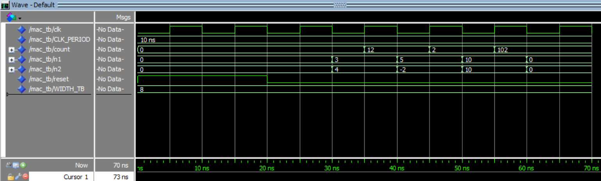

# VHDL Fixed-Point Multiply-Accumulate (MAC) Unit

A synthesizable, parameterized Fixed-Point Multiply-Accumulate (MAC) architecture designed in VHDL, targeting FPGA-accelerated mathematical operations and DSP pipelines.

## 🛠️ Architecture & Features
* **Operation:** Computes output = sum(n1 * n2) + accum on every clock cycle with synchronous control logic.
* **Fixed-Point Precision:** Implements parameterized bit-width configurations (`generic` map) for flexible datapath width and numerical precision control.
* **Synchronous Datapath:** Includes active-high reset (`reset`), clock (`clk`), and accumulator register handling to prevent wraparound errors during repeated additions.
* **Coding Standard:** Written using pure IEEE `numeric_std` packages for standard synthesizable RTL design.

## 📁 Repository Structure
```text
├── rtl/      # Core VHDL source files (MAC datapath)
├── tb/       # Testbench files and test vector stimuli
├── docs/     # Simulation waveforms and documentation
└── README.md
```

## 🛠️ Tools Used
* **Language:** VHDL (`ieee.std_logic_1164`, `ieee.numeric_std`)
* **Simulation & Verification:** QuestaSim / ModelSim

## 📊 Functional Verification

The datapath was functionally verified using custom VHDL testbenches in **QuestaSim**.

Below is the simulation waveform illustrating consecutive multiplication and accumulation cycles, verifying proper accumulator reset, clock timing, and numerical stability:


